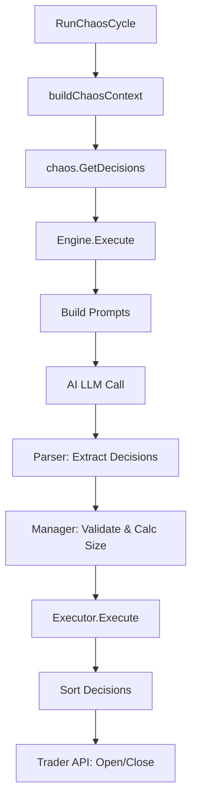

# Chaos 周期执行完整流程文档

本文档详细梳理了 Chaos 策略从 `RunChaosCycle` 开始到一个完整周期执行结束的详细流程。

## 1. 入口与上下文构建 (Context Building)

**文件**: [trader/auto_trader_chaos.go](file:///Users/zhengningdai/workspace/skyold/nofx/trader/auto_trader_chaos.go)

### `RunChaosCycle()`

- **作用**: Chaos 策略的周期入口函数。
- **流程**:
    1. **调用 `at.buildChaosContext()` 构建数据上下文**。
    2. **调用 `chaos.GetDecisions()` 获取 AI 决策**。
    3. **调用 `at.processChaosResult()` 处理结果（执行与记录）**。

### `buildChaosContext()`

- **作用**: 从交易所接口和内部状态中收集所有必要数据，打包成 `ChaosContext`。
- **包含数据**:
    1. **账户信息**: 权益、余额、未实现盈亏。
    2. **持仓快照**: 当前所有持仓的详细信息。
    3. **市场数据**: 候选币种的 K 线、指标数据 (调用 `market.GetWithTimeframes`)。
    4. **排行数据**: OI Top、涨跌幅排行等。

## 2. 核心引擎执行 (Engine Execution)

**文件**: [chaos/engine.go](file:///Users/zhengningdai/workspace/skyold/nofx/chaos/engine.go)

### `GetDecisions(ctx, client)`

- **作用**: 初始化 `ChaosEngine` 并调用其 `Execute` 方法。

### `Execute(ctx, client)`

- **作用**: 核心调度函数，负责 Prompt 构建、AI 调用、解析与验证。
- **流程**:
    1. **构建 Prompt**:
        - System Prompt: 调用 `e.buildSystemPromptWithContext` -> [chaos/manager.go](file:///Users/zhengningdai/workspace/skyold/nofx/chaos/manager.go) 的 `BuildPrompt`（包含 SystemExecutionContract 和动态指标配置）。
        - User Prompt: 调用 `e.BuildUserPromptFromChaosContext` -> [chaos/user_prompt.go](file:///Users/zhengningdai/workspace/skyold/nofx/chaos/user_prompt.go)（组装市场状态、持仓、K线数据）。
    2. **调用 AI**: `mcpClient.CallWithMessages`。
    3. **解析结果**: 调用 `extractDecisions` ([chaos/parser.go](file:///Users/zhengningdai/workspace/skyold/nofx/chaos/parser.go)) 提取 AI 返回的 JSON 决策。
    4. **验证与风控**: 调用 `e.validateDecisions`。

### `validateDecisions(decisions, ...)`

- **作用**: 对 AI 的决策进行风控检查和参数计算。
- **关键调用**: `e.manager.ValidateDecision` ([chaos/manager.go](file:///Users/zhengningdai/workspace/skyold/nofx/chaos/manager.go))。
    1. **在此处根据账户权益和风险配置计算 **`PositionSizeUSD`** (仓位金额)**。
    2. **这是 AI 决策转化为可执行指令的关键一步**。

## 3. 结果处理与执行 (Execution)

**文件**: [trader/auto_trader_chaos.go](file:///Users/zhengningdai/workspace/skyold/nofx/trader/auto_trader_chaos.go)

### `executeChaosDecision(result, ctx)`

- **作用**: 接收 Engine 返回的决策结果，初始化执行器并记录日志/数据库。
- **流程**:
    1. 初始化 `ChaosExecutor`。
    2. 调用 `executor.Execute(result.Decisions)`。
    3. 将完整的决策记录（包括原始 Prompt 和 AI 响应）保存到数据库 (`store.Decision().LogDecision`)。

**文件**: [chaos/executor.go](file:///Users/zhengningdai/workspace/skyold/nofx/chaos/executor.go)

### `Execute(decisions)`

- **作用**: 执行具体的交易动作。
- **流程**:
    1. **排序**: 调用 `sortDecisions`，优先执行平仓 (`close`) 操作，释放保证金后再执行开仓 (`open`)。
    2. **遍历执行**: 对每个决策调用 `executeSingle`。

### `executeSingle(decision)` -> `executeOpen` / `executeClose`

- **作用**: 将抽象的决策转化为具体的交易所 API 调用。
- **逻辑**:
    1. **读取 `Decision` 中的 `PositionSizeUSD`**。
    2. **获取当前市价**，计算 `Quantity` (数量 = 金额 / 价格)。
    3. **调用 `e.trader.OpenLong` / `OpenShort` 等接口下单**。

## 4. 流程图

